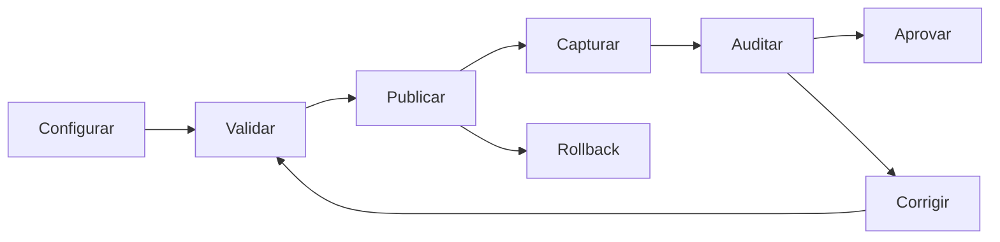
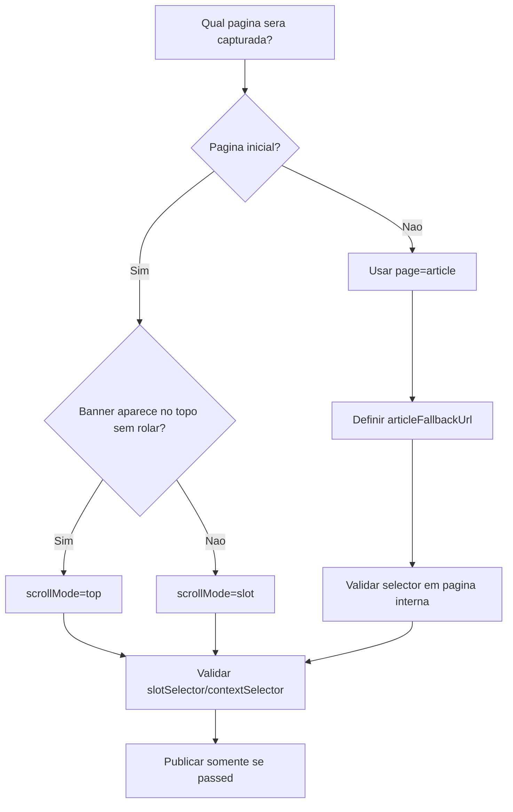
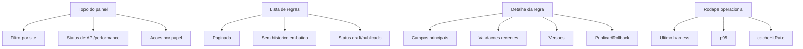
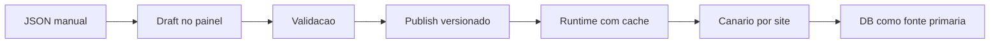

# Infografico v1 — Opcoes da Configuracao de Captura/Auditoria

## Visao rapida

## Opcoes principais

| Opcao | Quando usar | Resultado esperado |
|---|---|---|
| Criar draft | Novo site, novo slot ou nova posicao | Regra editavel sem afetar capturas reais |
| Editar draft | Ajuste de selector, pagina, scroll ou auditoria | Mudanca isolada ate passar validacao |
| Validar individual | Uma regra especifica | Resultado `passed` ou `failed` |
| Validar em lote | Varias regras de um site | Menos requests e melhor controle de carga |
| Publicar | Regra validada e pronta | Runtime passa a consumir a nova versao |
| Rollback | Captura ou auditoria regrediu | Volta para versao anterior publicada |
| Consultar performance | Antes/depois de publicar | Ver cache, p95 e query count |
| Fallback JSON | Falha de API/DB ou canario ruim | Mantem operacao funcionando |

## Configuracoes de captura

| Campo | Opcoes | Uso pratico |
|---|---|---|
| `page` | `home`, `article` | Define se o print e da inicial ou pagina interna |
| `scrollMode` | `top`, `slot` | `top` para banner no topo; `slot` quando precisa rolar |
| `proofStyle` | `viewport_only`, `viewport_with_slot_inset` | Prova em posicao real ou com destaque do slot |
| `slotSelector` | seletor CSS | Elemento exato do anuncio |
| `contextSelector` | seletor CSS | Area visual usada para validar contexto |
| `articleFallbackUrl` | URL HTTPS | Pagina interna exemplo para validar/capturar |
| `auditConfig` | JSON controlado | Thresholds por site/slot |

## Escolha por tipo de pagina

## Escolha por problema encontrado

| Problema | Verificar primeiro | Acao |
|---|---|---|
| Print sem banner | `slotSelector` e `contextSelector` | Ajustar draft e validar |
| Banner fora da posicao | `scrollMode` e prova final | Preferir posicao real quando for requisito |
| Auditoria com divergencia | `auditConfig` por site/slot | Ajustar threshold local, sem relaxar global |
| Pagina interna errada | `page` e `articleFallbackUrl` | Corrigir URL e validar |
| Validacao lenta | `validate-batch`, circuit breaker | Reduzir concorrencia e usar lote |
| Runtime lento | `cacheHitRate`, `avgQueriesPerRuntimeCall` | Conferir cache L1/L2 e filtros |
| Erro apos publish | historico de versoes | Executar rollback |
| API retornou 404 | deploy das rotas | Publicar API/Worker antes de usar |

## Painel ideal para operacao

## Checklist visual antes de publicar

| Item | Status esperado |
|---|---|
| Site correto | `siteSigla` confere com o portal |
| Posicao correta | `groupId` confere com AdRotate |
| Pagina correta | `home` ou `article` conforme campanha |
| Selector correto | slot existe no HTML real |
| Contexto correto | area visual mostra o banner no layout certo |
| Validacao | `passed` |
| Performance | p95 e query budget aceitaveis |
| Rollback | versao anterior disponivel |

## Mapa de maturidade

## Regra pratica
Use o painel para mudar comportamento. Use o JSON apenas como contingencia ou export.

Uma regra so deve virar producao quando:

- passou pela validacao,
- foi testada em captura real,
- manteve performance dentro do budget,
- tem rollback conhecido.
