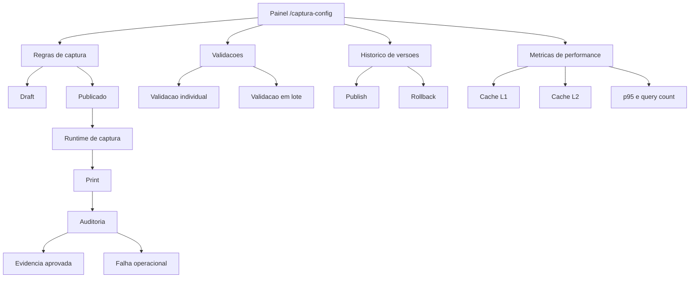
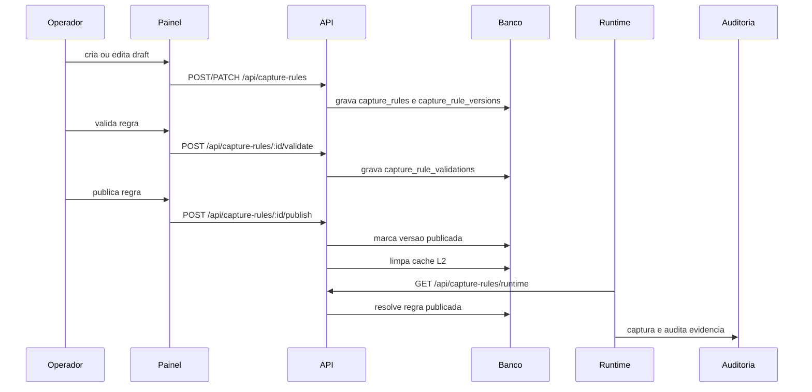
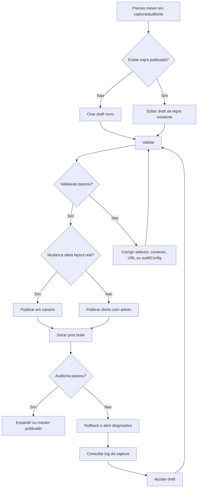
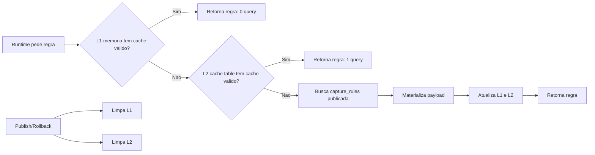
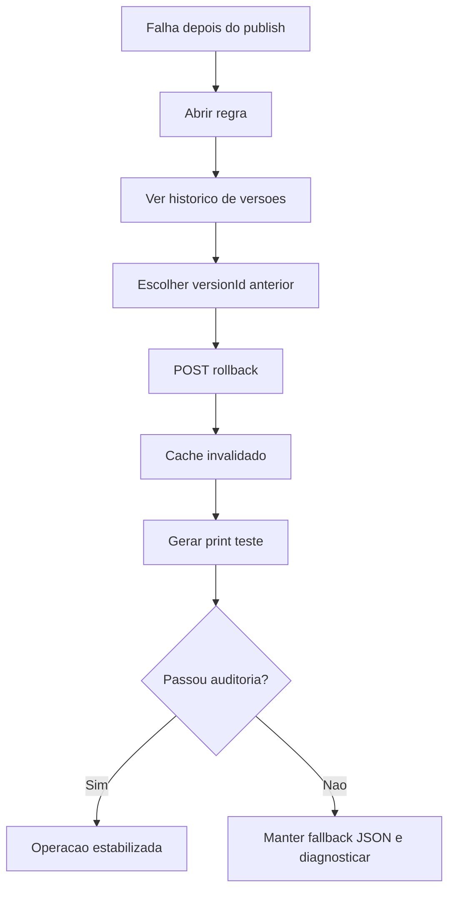
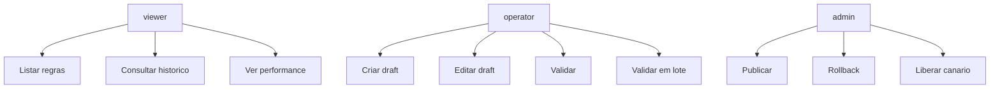

# Organograma e fluxos v1 — Configuração de Captura/Auditoria

## Organograma do recurso

## Fluxo principal

## Arvore de decisao operacional

## Situacoes previstas

| Situacao | Ação correta | Risco se ignorar |
|---|---|---|
| Novo slot no AdRotate | Criar draft por `siteSigla + groupId` | Captura cair no fallback errado |
| Tema mudou layout | Editar draft e validar em canário | Quebrar prints retroativos de outras inserções |
| Banner moveu para área com scroll | Ajustar `scrollMode` e `contextSelector` | Print sem banner visível |
| Página interna precisa de prova | Usar `page=article` e `articleFallbackUrl` | Validação falhar ou usar home por engano |
| Muitos slots de um site | Usar `validate-batch` | Muitas requests e mais latência |
| Publicação causou erro | Rollback por `versionId` | Continuar gerando evidências inválidas |
| API de configuração caiu | Usar fallback JSON temporário | Operação parar por dependência nova |
| p95 subiu | Conferir cache, paginação e batch | Banco receber carga desnecessária |

## Fluxo de cache e performance

## Fluxo de rollback

## Responsabilidades por papel

