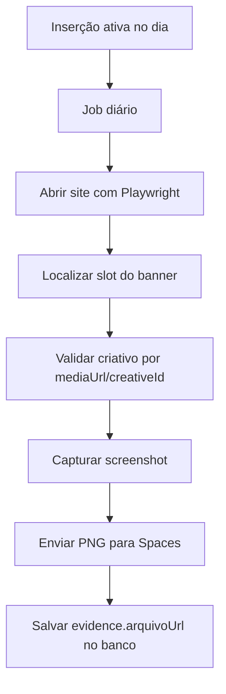

# Arquitetura Fase 2: Cloudflare Pages, DigitalOcean Spaces e Print Automático

## Objetivo

Definir a arquitetura alvo para a Fase 2 considerando:

- frontend em Cloudflare Pages
- mídias e prints em DigitalOcean Spaces
- automação de print sem uso de token de IA

## 1. Diretriz principal

O fluxo de print automático deve ser determinístico.

Isso significa:

- sem IA para descobrir qual banner está no ar
- sem IA para fazer matching visual
- sem consumo de token no dia a dia

## 2. Arquitetura recomendada

### Frontend

- hospedar o frontend em `Cloudflare Pages`

### API

Opções viáveis:

1. manter a API separada do Pages
2. migrar a API para `Cloudflare Workers`

Durante a transição, o caminho mais seguro é:

- `Pages` para frontend
- API atual em serviço separado
- PostgreSQL mantido fora do Pages

## 3. Uso do DigitalOcean Spaces

O Spaces deve armazenar:

- prints automáticos
- thumbnails
- evidências anexadas
- opcionalmente mídia de referência

Estrutura sugerida:

- `adops-prints/{competencia}/{campanhaId}/{insercaoId}/`

Exemplos:

- `adops-prints/ABRIL-2026/623/865/2026-04-03.png`
- `adops-prints/ABRIL-2026/623/1067/2026-04-15-instagram.png`

## 4. Estratégias possíveis para gerar print automático

### Estratégia A — Screenshot direto do site com seletor da posição

Como funciona:

- abrir a página do portal
- localizar o slot do banner por seletor CSS
- capturar screenshot do slot

Prós:

- simples
- barato
- rápido

Contras:

- não garante que o criativo capturado seja o da inserção correta quando há rotação

Conclusão:

- útil só quando o slot tem um banner único

### Estratégia B — Screenshot do site + validação por `mediaUrl`

Como funciona:

- abrir a página
- localizar o slot
- ler `src`, `href`, `data-*` ou background image do banner visível
- comparar com a `mediaUrl` esperada da inserção
- capturar screenshot só se houver match

Prós:

- não usa IA
- resolve boa parte dos casos com imagem/GIF
- funciona bem quando o banner carrega URL estável

Contras:

- depende do DOM expor a URL real do criativo
- pode falhar quando o site usa lazy load, JS agressivo ou rotação dinâmica

Conclusão:

- é a melhor base para banners simples e GIFs

### Estratégia C — Forçar o criativo por query param ou modo preview

Como funciona:

- criar no portal um modo de preview do slot
- passar `insertionId`, `creativeId` ou `mediaUrl`
- renderizar só o criativo desejado
- capturar screenshot da página de preview

Prós:

- é a forma mais confiável
- elimina problema de rotação
- garante que o print pertença à inserção correta

Contras:

- exige ajuste nos portais
- depende de apoio do time de sites

Conclusão:

- melhor solução de médio prazo

### Estratégia D — Página interna de comprovação

Como funciona:

- o sistema gera uma página própria de prova
- essa página mostra:
  - logo do site
  - campanha
  - período
  - mídia da inserção
  - data/hora
- o print é tirado dessa página

Prós:

- extremamente estável
- não depende de DOM do portal
- simples de automatizar

Contras:

- não prova que o banner estava realmente no ar no site
- funciona como prova operacional, não como prova plena de veiculação

Conclusão:

- útil como fallback

### Estratégia E — Screenshot híbrido

Como funciona:

- tentar primeiro validar no site real
- se o banner correto for identificado, salvar print real
- se não for possível, gerar print fallback da página interna

Prós:

- melhor equilíbrio entre confiabilidade e produtividade

Conclusão:

- estratégia mais recomendada para implantação progressiva

## 5. Melhor caminho para o caso do `MEGABANNER TOPO`

Como esse slot costuma ter mais de um banner, o controle precisa ser por identidade do criativo.

Sem IA, há 4 formas práticas:

1. comparar a URL do criativo carregado com a `mediaUrl` da inserção
2. comparar um `creativeId` explícito no DOM
3. usar um modo preview que force o banner da inserção
4. capturar a página interna de comprovação como fallback

### Recomendação realista para este projeto

#### Fase 2A

- usar Playwright
- abrir a página real
- localizar o slot do banner
- inspecionar o DOM
- comparar com `mediaUrl`
- se bater, capturar o slot

#### Fase 2B

- adicionar nos portais um `modo preview` por inserção ou criativo

Exemplo:

- `/preview-banner?slot=mega-topo&creative=825x120-pref-3.gif`
- `/preview-banner?insercaoId=860`

#### Fase 2C

- quando não houver match confiável, gerar fallback de comprovação interna

## 6. Como controlar o banner correto sem IA

O sistema deve depender de pelo menos um identificador determinístico:

- `mediaUrl`
- `creativeId`
- `bannerSlug`
- `assetHash`

### Recomendação de dados

Adicionar no futuro:

- `insertions.creative_key`
- `insertions.print_capture_selector`
- `insertions.print_capture_url`
- `insertions.print_capture_strategy`

## 7. Estratégia recomendada de automação

### Worker de captura

Um job executa diariamente:

1. busca inserções que exigem print no dia
2. abre o site com Playwright
3. tenta localizar o slot correto
4. tenta validar o criativo esperado
5. tira screenshot
6. salva no Spaces
7. grava evidência na inserção

## 8. Fluxo sem IA

## 9. Critérios de sucesso do print automático

O print automático só deve ser marcado como válido quando:

- o slot correto foi identificado
- o criativo bate com o esperado
- a imagem foi salva com sucesso
- a evidência foi vinculada à inserção correta

## 10. Fallback obrigatório

Se não houver confirmação determinística do banner correto:

- não marcar automaticamente como prova válida do site
- registrar tentativa
- opcionalmente gerar prova interna/fallback
- deixar a inserção como pendente de validação manual

## 11. Observação sobre o Spaces informado

No arquivo local analisado, os identificadores apontam hoje para:

- bucket: `perrenguematogrosso`
- endpoint: `nyc3.digitaloceanspaces.com`
- base path atual: `app/uploads`

Isso precisa ser conciliado com a decisão de usar o bucket/space `cod5`.
