# Plano Futuro: Automação de Captura de PI

## Objetivo

Ao receber uma PI por e-mail ou WhatsApp, criar automaticamente um rascunho operacional da campanha, com o mínimo de intervenção humana.

## Princípio importante

Durante a implantação, a automação deve priorizar extração determinística e regras explícitas.

Uso de IA deve ficar para:

- PDFs fora do padrão
- documentos escaneados ruins
- exceções de classificação

Isso reduz custo e evita gasto de token desnecessário.

## Fluxo sugerido

```mermaid
flowchart LR
    A["Email / WhatsApp"] --> B["Captura do anexo ou link"]
    B --> C["Armazenamento em Drive/R2/Pasta monitorada"]
    C --> D["Parser determinístico do PDF"]
    D --> E["Match de agência, cliente e veículo"]
    E --> F["Aplicação do perfil agência + cliente"]
    F --> G["Geração de rascunho da campanha"]
    G --> H["Revisão humana no dashboard"]
    H --> I["Confirmação e criação das inserções"]
```

## Entradas suportadas

- anexo em e-mail
- link para PDF em e-mail
- arquivo enviado por WhatsApp
- imagem/PDF compartilhado em grupo operacional

## Campos a extrair primeiro

- agência
- cliente
- PI
- competência
- período
- campanha
- produto
- praça
- condição de pagamento
- faturamento
- valor
- linhas da grade de exibição

## Estratégia técnica recomendada

### Etapa 1

- e-mail como canal inicial
- webhook ou polling controlado
- salvar anexos em pasta monitorada
- rodar parser local
- criar rascunho no banco

### Etapa 2

- WhatsApp com integração do canal escolhido
- normalizar arquivo recebido
- aplicar mesmo parser

### Etapa 3

- feedback loop:
  - operador corrige rascunho
  - sistema aprende aliases e padrões

## Componentes futuros

- `inbound_documents`
- `document_parse_runs`
- `document_parse_fields`
- `agency_client_profiles`
- `draft_campaigns`
- `draft_insertions`

## Regras de segurança operacional

- nunca publicar automaticamente sem revisão humana
- nunca excluir histórico se um parse falhar
- guardar o arquivo original e o parse bruto
- versionar cada tentativa de extração

## Gatilhos de baixo custo

### E-mail

- Gmail com filtro por remetente/assunto
- Apps Script ou webhook para avisar a API

### Planilha

- Apps Script chama webhook na dashboard ao atualizar

### WhatsApp

- integração do provedor salva arquivo recebido e chama endpoint local

## Resultado esperado

O operador deixa de cadastrar do zero.

Ele passa a:

1. abrir o rascunho
2. revisar os campos
3. ajustar exceções
4. confirmar a criação
