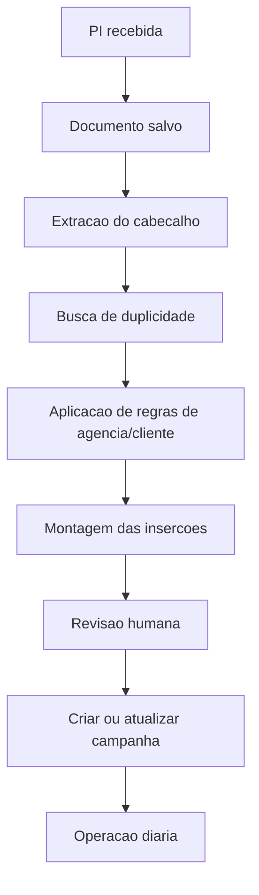

# Fluxo Completo de Importação de PI

## Objetivo

Definir o fluxo operacional e técnico para transformar uma PI recebida por e-mail, WhatsApp ou cadastro manual em:

- campanha estruturada
- inserções corretas
- regras operacionais aplicadas
- base auditável

Este documento cobre tanto o fluxo atual manual quanto o fluxo futuro assistido.

## 1. Conceito principal

Uma PI não deve entrar diretamente como uma campanha simples.

Ela deve passar por estas etapas:

1. recebimento
2. identificação
3. conferência de duplicidade
4. extração dos dados
5. aplicação de regras
6. montagem da grade de inserções
7. revisão humana
8. confirmação
9. acompanhamento operacional

## 2. Canais de entrada

Hoje ou futuramente a PI pode chegar por:

- e-mail
- WhatsApp
- upload manual
- link para PDF
- imagem/PDF compartilhado internamente

## 3. Etapa 1 — Recebimento da PI

Objetivo:

- registrar que o documento chegou
- preservar o arquivo original

Entrada esperada:

- PDF principal da PI
- anexos auxiliares, se existirem

Saída desejada:

- documento salvo
- data de recebimento registrada
- origem registrada

Campos mínimos dessa etapa:

- `origem`
- `recebidoEm`
- `arquivoOriginal`
- `nomeArquivo`
- `canal`
- `observacoesRecebimento`

## 4. Etapa 2 — Identificação básica

Objetivo:

- descobrir se o documento é realmente uma PI
- identificar os elementos principais sem ainda criar campanha

Campos que devem ser lidos primeiro:

- agência
- cliente
- PI
- campanha
- competência
- período geral

Se esses campos não forem legíveis:

- o sistema deve criar rascunho incompleto
- nunca deve descartar o documento

## 5. Etapa 3 — Conferência de duplicidade

Objetivo:

- evitar criar campanha duplicada

Antes de cadastrar, o sistema deve buscar:

- `piCodigo`
- `nome da campanha`
- `cliente`
- `agência`
- `competência`

Regras de decisão:

### Caso A — PI já existe e está compatível

Exemplo:

- PI `89011` já existia
- PI `14028` já existia

Ação:

- enriquecer campanha existente
- não duplicar

### Caso B — PI existe, mas está incompleta

Ação:

- mostrar diff
- permitir completar sem recriar

### Caso C — PI não existe

Ação:

- criar nova campanha

## 6. Etapa 4 — Extração dos campos do cabeçalho

Objetivo:

- montar a campanha com os metadados reais da PI

Campos já considerados relevantes pelo projeto:

- `piCodigo`
- `nome`
- `competencia`
- `clienteId`
- `agenciaId`
- `projeto`
- `plano`
- `planilhaRef`
- `produto`
- `praca`
- `condicaoPagamento`
- `faturamentoTipo`
- `valorLiquido`
- `observacoes`

Campos que devem entrar em próximas fases:

- `codigoPeca`
- `pecaDescricao`
- `valorBruto`
- `desconto`
- `bonificacao`
- `valorFaturado`

## 7. Etapa 5 — Aplicação das regras por agência e cliente

Objetivo:

- transformar o documento em operação real

Depois de identificar `agência` e `cliente`, o sistema deve aplicar:

- exigência de aceite formal
- exigência de print diário
- exigência de NF detalhada
- exigência de declaração art. 299
- exigência de comprovante assinado
- prazo de envio de documentos
- tipo de faturamento

Hierarquia recomendada:

1. perfil `agência + cliente`
2. perfil da agência
3. regra global do sistema

## 8. Etapa 6 — Leitura da grade de exibição

Objetivo:

- transformar a grade comercial da PI em linhas operacionais

Cada linha operacional pode gerar uma inserção.

Campos esperados por linha:

- site
- formato/local
- período início
- período fim
- tipo de programação
- quantidade diária ou total
- bonificação, quando houver
- observações

## 9. Regra para montar inserções

### Quando criar uma inserção nova

Criar nova inserção quando houver mudança em:

- site
- formato/local
- período
- tipo de programação
- natureza da linha

### Quando não criar outra inserção

Não criar outra inserção se a informação for apenas:

- observação textual da mesma linha
- detalhe descritivo do mesmo formato
- detalhe documental da mesma PI

## 10. Tratamento de casos especiais

### Bonificação

Se a PI trouxer bonificação em linha separada:

- criar inserção própria
- marcar como bonificação em fase futura

Se não houver certeza:

- cadastrar provisoriamente como linha separada
- registrar observação para validação

### Coluna `B.` ou marcações específicas

Se o documento usar siglas ou colunas ambíguas:

- não assumir regra permanente
- criar observação rastreável
- destacar para confirmação com o cliente

### Cliente divergente da tabela histórica

Se o documento disser `SECOM`, mas a base histórica estiver em `Governo do Estado`:

- manter a referência atual se já houver histórico consolidado
- registrar observação
- corrigir depois pela governança da tabela mestre

## 11. Etapa 7 — Revisão humana antes do commit

Objetivo:

- impedir erro operacional antes da criação definitiva

Checklist mínimo:

- PI correta
- cliente correto
- agência correta
- competência correta
- número de inserções correto
- formatos corretos
- períodos corretos
- regras documentais corretas
- faturamento correto

## 12. Etapa 8 — Commit

Objetivo:

- gravar campanha e inserções no banco com trilha auditável

Na gravação, o sistema deve:

- criar ou atualizar campanha
- criar ou atualizar inserções
- preservar observações e premissas
- registrar lote de importação futuro

## 13. Etapa 9 — Pós-importação

Objetivo:

- permitir que a operação trabalhe sem voltar ao documento bruto

Depois do commit, a equipe deve conseguir:

- abrir a campanha
- abrir as inserções
- publicar
- gerar prints
- enviar para agência
- enviar documentos

## 14. Fluxo atual manual

Hoje, o melhor fluxo operacional é:

1. receber a PI
2. abrir o wizard em [NewCampaign.tsx](/Users/leandrobosaipo/Projetos/AdOps/artifacts/adops/src/pages/NewCampaign.tsx)
3. conferir se a PI já existe
4. se existir, enriquecer a campanha existente
5. se não existir, criar nova campanha
6. montar as inserções conforme a grade do documento
7. revisar
8. salvar

## 15. Fluxo futuro assistido

Fluxo desejado:

## 16. Critérios para considerar uma PI corretamente importada

Uma PI está corretamente importada quando:

- campanha representa o cabeçalho real do documento
- inserções representam a grade real de exibição
- regras operacionais aplicáveis estão visíveis
- não existe duplicidade indevida
- eventuais ambiguidades ficaram registradas

## 17. Casos reais já aplicados no projeto

### PI 89011

Decisão tomada:

- não criar nova campanha
- enriquecer a campanha `626`

Resultado:

- campanha atualizada com metadados reais
- inserção normalizada para `BANNER INTERNO NOTICIAS`

### PI 14028

Decisão tomada:

- não criar nova campanha
- enriquecer a campanha `623`

Resultado:

- campanha atualizada com metadados reais
- desdobramento em 3 inserções
- linha `B.` registrada como premissa provisória

## 18. O que precisa existir no sistema para esse fluxo ficar completo

### Já existe

- campanha
- inserção
- evidência
- wizard manual
- gestão de agência

### Falta

- perfil `agência + cliente`
- `codigoPeca`
- bonificação como campo estruturado
- importação com preview
- histórico de lotes
- diff antes de atualizar campanha existente
- cadastro de documento recebido

## 19. Regras de segurança

- nunca excluir histórico automaticamente
- nunca sobrescrever silenciosamente uma campanha existente
- sempre registrar observações quando houver interpretação manual
- sempre conferir duplicidade antes de cadastrar

## 20. Documentos relacionados

- memória do projeto: [base-de-conhecimento-do-projeto.md](/Users/leandrobosaipo/Projetos/AdOps/docs/base-de-conhecimento-do-projeto.md)
- análise das PIs: [analise-pis-modelo.md](/Users/leandrobosaipo/Projetos/AdOps/docs/analise-pis-modelo.md)
- automação futura: [automacao-captura-pi.md](/Users/leandrobosaipo/Projetos/AdOps/docs/automacao-captura-pi.md)
- plano de importação: [plano-importacao-e-adequacao.md](/Users/leandrobosaipo/Projetos/AdOps/docs/plano-importacao-e-adequacao.md)
