# Fluxos Visuais do Bot Telegram AdOps

Baseado no código atual do worker do Telegram:

- `ops/cloudflare-telegram-bot/src/index.ts`

Objetivo:

- mostrar o que cada comando faz
- mostrar as condições
- mostrar quando o bot só consulta e quando ele altera estado

## Visão geral

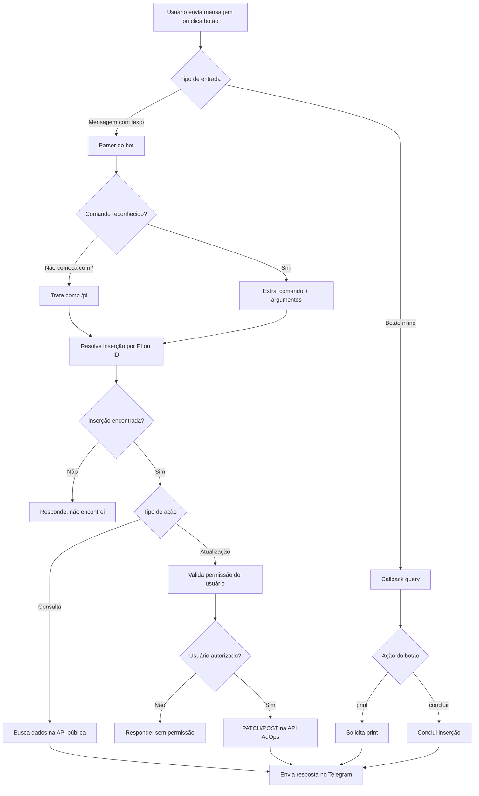

## Regras base

- Mensagem sem `/` vira consulta automática:
  - `14011`
  - `pi14011`
  - `PI 14011`
- O bot tenta resolver por:
  - ID da inserção
  - PI
  - nome da campanha
- Comandos de update exigem que o usuário seja o `TELEGRAM_ALLOWED_USER_ID`.
- O bot usa:
  - API pública para leitura
  - rota protegida para atualização de status

## Fluxo `/start` e `/help`

Função:

- mostrar como usar
- listar os comandos
- opcionalmente exibir botão do Mini App

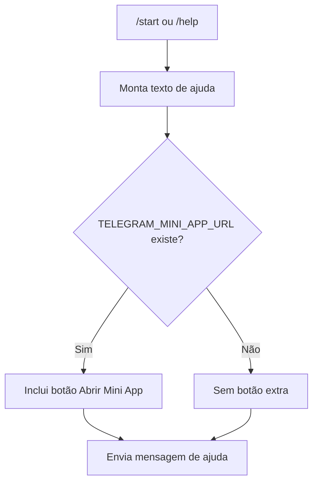

## Fluxo de consulta `/pi`

Função:

- localizar inserção
- mostrar resumo operacional
- mostrar botões de ação

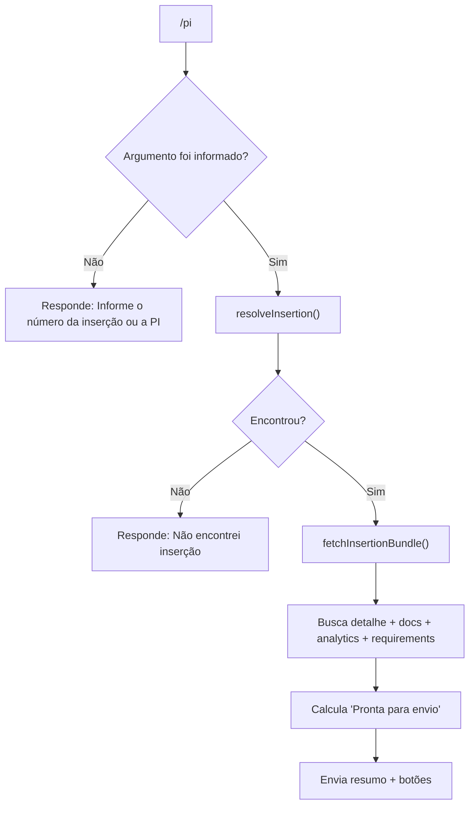

### Condições do resumo

O resumo exibe:

- PI
- inserção
- campanha
- site
- formato
- período
- status
- print
- docs
- analytics
- evidências auditadas
- pronta para envio

### Como o bot define `Pronta para envio`

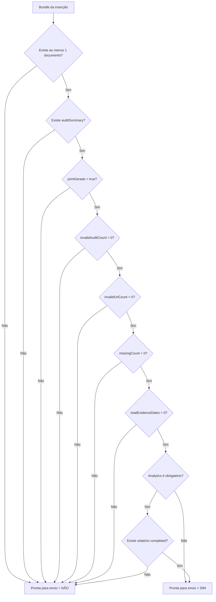

## Fluxo de consulta sem comando

Função:

- reduzir fricção
- permitir usar só o número da PI ou da inserção

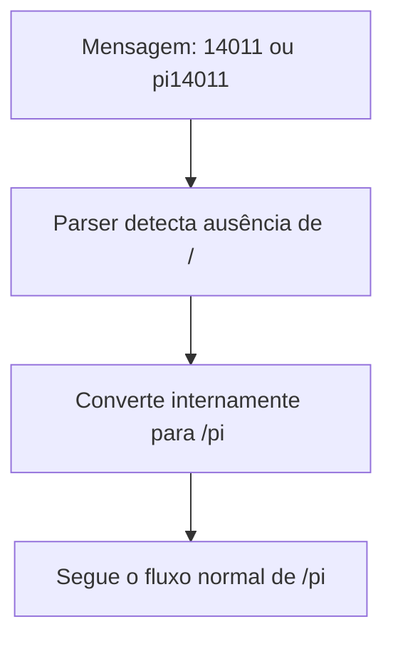

## Fluxo `/zip`

Função:

- gerar link do ZIP consolidado da inserção

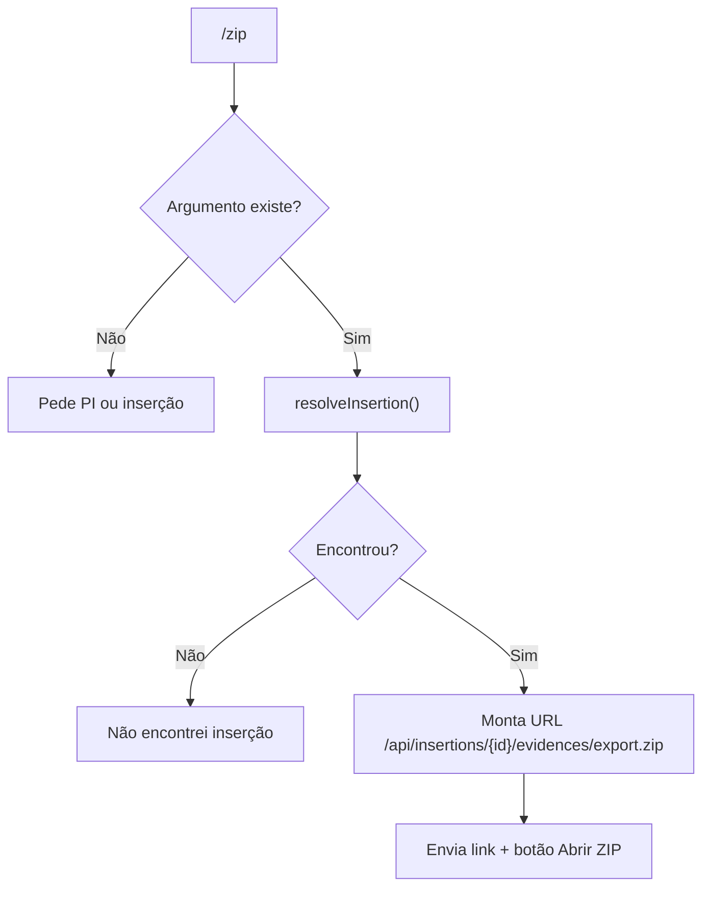

## Fluxo `/print`

Função:

- solicitar o print de hoje para a inserção

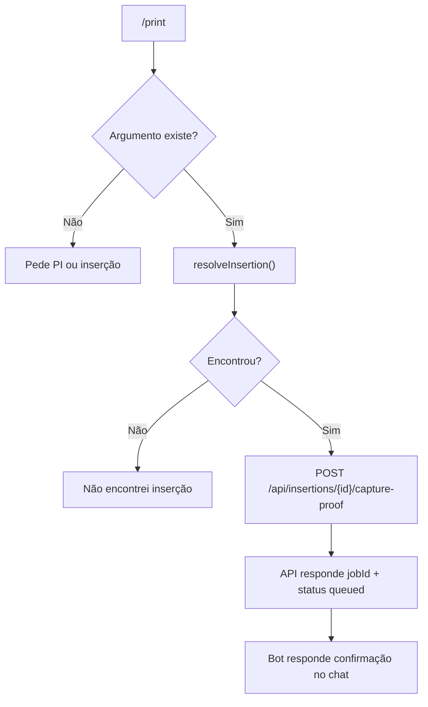

### Condições

- não exige permissão especial
- não conclui nada
- só enfileira a captura

## Fluxo `/retro`

Função:

- solicitar print retroativo para uma data específica

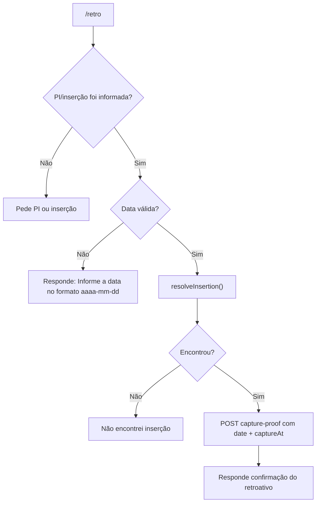

### Condições

- data obrigatória
- formato obrigatório: `aaaa-mm-dd`

## Fluxo `/concluir`

Função:

- concluir operacionalmente a inserção

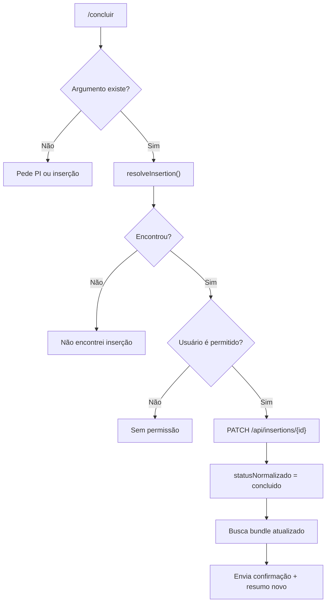

### Condições

- exige permissão
- altera estado

## Fluxo `/enviado`

Função:

- marcar que o processo foi enviado para a agência

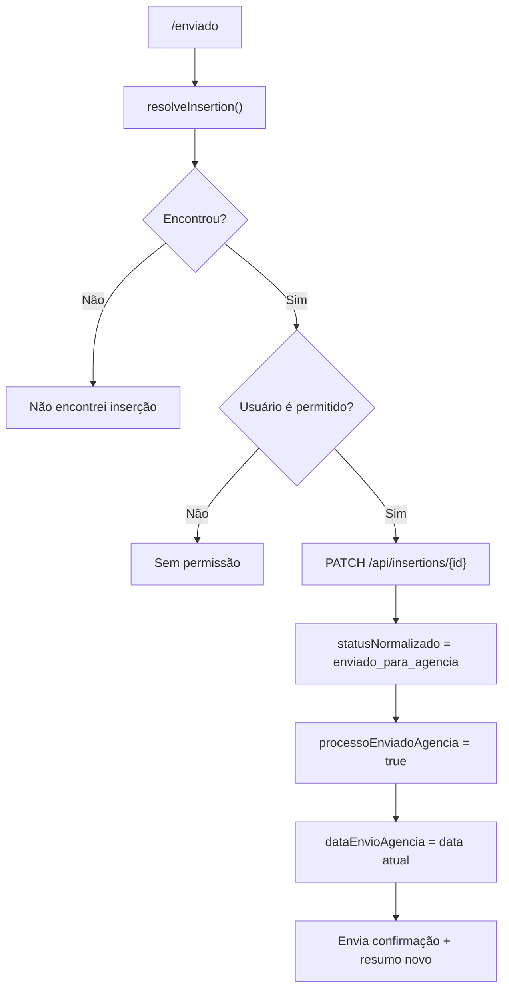

## Fluxo `/docs`

Função:

- marcar que os documentos foram enviados

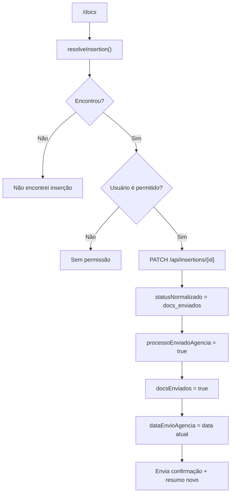

## Fluxo dos botões inline

Botões atuais:

- `Abrir inserção`
- `Abrir ZIP`
- `Print hoje`
- `Concluir`

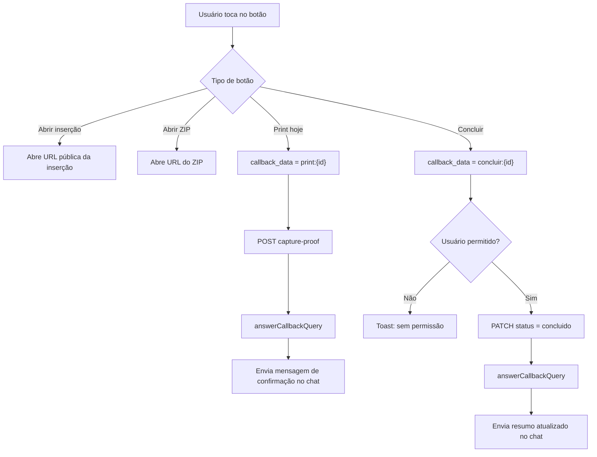

## Estados e efeitos no bot

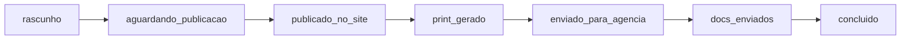

Observação:

- o bot hoje não aplica todas as transições intermediárias
- ele atua diretamente nestes estados:
  - `enviado_para_agencia`
  - `docs_enviados`
  - `concluido`

## Motivo do erro visto no print

Erro mostrado:

- `Telegram API answerCallbackQuery falhou: 400`
- `query is too old and response timeout expired or query ID is invalid`

Isso acontece quando:

- o callback do botão já expirou
- ou o Telegram já considera aquele `query_id` velho

Na prática:

- não é erro de parser
- não é erro da API AdOps
- é erro de resposta tardia ao callback do Telegram

Fluxo:

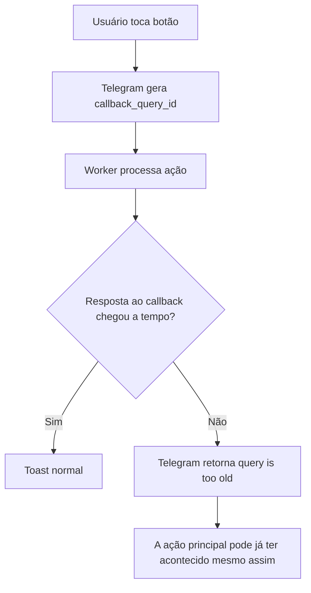

## Resumo operacional

### Comandos só de consulta

- `/start`
- `/help`
- `/pi`
- `/zip`

### Comandos que geram trabalho

- `/print`
- `/retro`

### Comandos que alteram estado

- `/enviado`
- `/docs`
- `/concluir`

### Entradas simplificadas

- `14011`
- `pi14011`
- `PI 14011`

## Melhorias futuras recomendadas

- editar a própria mensagem após `Concluir`, em vez de mandar nova mensagem
- adicionar botão `Enviado`
- adicionar botão `Docs enviados`
- adicionar botão `Gerar retroativo`
- trocar retorno cru do JSON do job por mensagem mais legível
- registrar status do job depois:
  - `queued`
  - `running`
  - `completed`
  - `failed`
