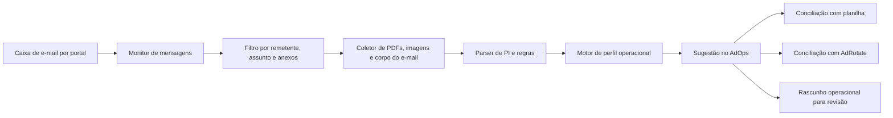

# Plano de Integração Futura

## Objetivo

Documentar a próxima fase do AdOps, sem implementar ainda:

1. monitorar novos e-mails por portal
2. identificar anexos e PIs
3. extrair dados da PI
4. sugerir criação ou atualização de campanha/inserção no AdOps
5. relacionar ou cadastrar anúncio no AdRotate
6. preparar o documento final para envio à agência

## Estado atual

Hoje o sistema já:

- gerencia inserções
- sincroniza a planilha
- concilia com AdRotate
- gera prints
- audita prints

Isso significa que a próxima fase não começa do zero. A base operacional já existe.

## O que ainda não deve ser automatizado agora

Ainda precisam de validação antes da implementação:

- modelo final do documento enviado para a agência
- estratégia de credenciais de e-mail
- política de múltiplos remetentes por agência
- regra de criação automática versus rascunho para revisão humana

## Arquitetura sugerida

## Etapa 1 — Monitoramento de e-mail

Meta:

- observar novas mensagens
- identificar anexos relevantes
- não consumir IA no fluxo normal

Recomendação:

- usar integração de e-mail por IMAP/API
- monitorar múltiplas caixas por portal
- salvar metadados mínimos:
  - mailbox
  - remetente
  - assunto
  - data
  - message-id
  - anexos

Critério de entrada:

- mensagem com PDF de PI
- ou assunto com padrão operacional conhecido
- ou remetente já mapeado para agência

## Etapa 2 — Pré-classificação da mensagem

Meta:

- descobrir se o e-mail é:
  - nova PI
  - retificação
  - aceite
  - cobrança documental

Sinais úteis:

- número da PI
- nome da campanha
- cliente
- agência
- datas
- palavras como:
  - aceite
  - retificação
  - bonificação
  - reaplicação

## Etapa 3 — Parser de PI

Meta:

- extrair de forma determinística, sem IA no caminho normal:
  - PI
  - cliente
  - agência
  - produto
  - praça
  - faturamento
  - condição de pagamento
  - linhas de inserção
  - posição
  - datas
  - quantidade de dias

Saída desejada:

- objeto estruturado de PI
- lista de alertas
- campos ambíguos marcados para revisão

## Etapa 4 — Aplicação do perfil operacional

Meta:

- descobrir automaticamente o perfil que vale:
  - padrão
  - DMD
  - ZF
  - Genius
  - Renca
  - Renca + SECOM

Resultado:

- prazos sugeridos
- checklist documental
- necessidade de print diário
- necessidade de preservar janelas separadas da PI

## Etapa 5 — Decisão de sincronização

Prioridade já combinada:

1. planilha
2. AdRotate
3. PI/e-mail

Então a automação deve:

- primeiro conferir se já existe campanha ou inserção no AdOps
- depois comparar com planilha
- depois comparar com o site/AdRotate
- só então propor:
  - criar
  - atualizar
  - dividir
  - marcar divergência

## Etapa 6 — Relação com AdRotate

Meta:

- encontrar anúncio existente pelo:
  - nome
  - PI
  - mídia
  - grupo

Se houver match seguro:

- vincular ao AdOps
- atualizar sufixo do anúncio

Se não houver:

- abrir fila de pendência de conciliação

## Etapa 7 — Documento de envio à agência

Meta:

- montar pacote final com:
  - comprovantes
  - resumo da campanha
  - docs exigidos por agência

Dependências antes de implementar:

- modelo final do documento
- regras de assinatura e anexos por agência

## Princípios importantes

- não gastar token de IA no fluxo normal
- preferir parser determinístico
- usar IA só para exceções futuras, se necessário
- nunca criar ou alterar histórico automaticamente quando houver ambiguidade forte
- em caso de dúvida, abrir rascunho para revisão humana

## Resultado esperado da próxima fase

Quando essa fase começar de verdade, o operador deve:

1. receber um alerta de nova PI
2. abrir um rascunho quase pronto no AdOps
3. revisar divergências
4. confirmar
5. seguir para conciliação com AdRotate e operação
